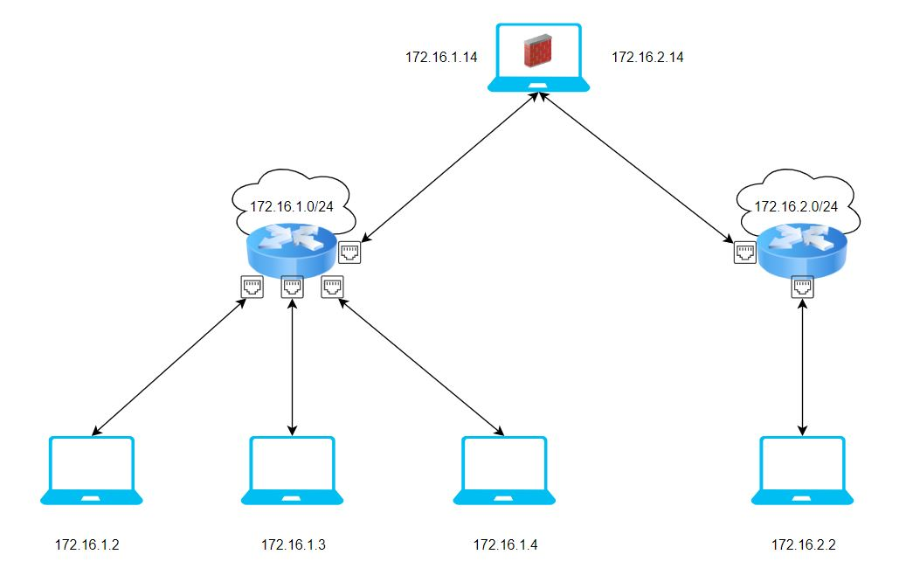
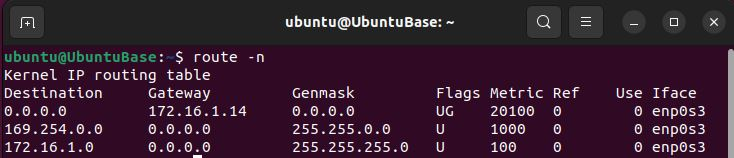
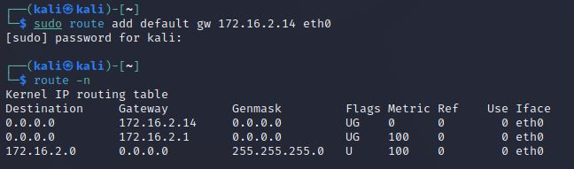
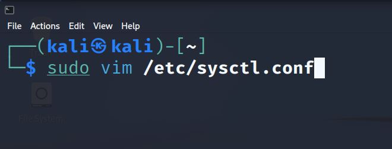
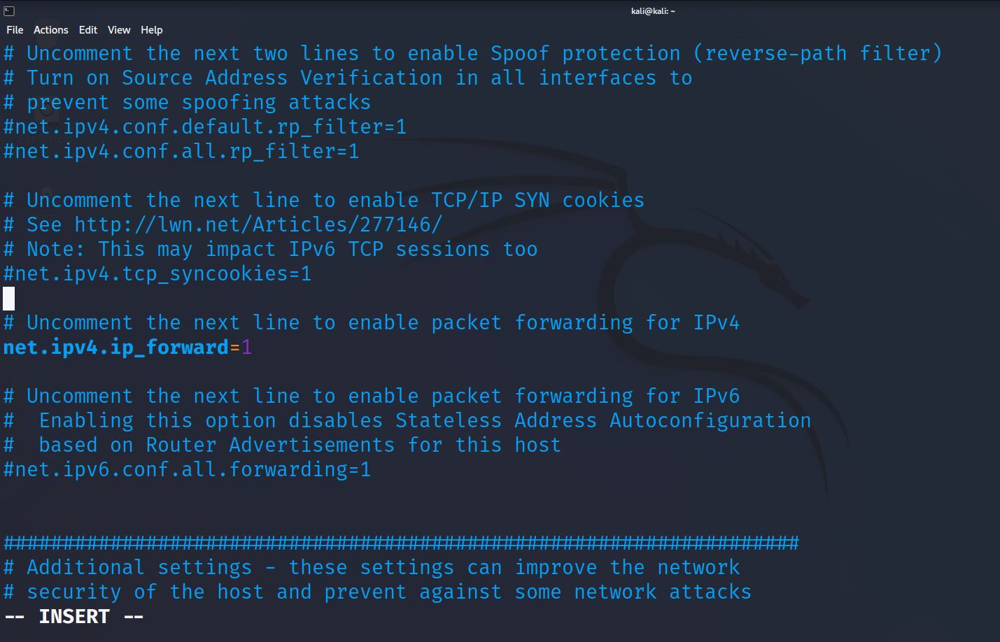

# Iptables

In this secction we will learn how to configure a firewall with kali-linux.

The lab created is shown in the image.



## Create default gateways

When a manchine tries to acces a IP address which is not inside the subnet, we can define a default gateway to send the packet. In this case, the default gateway will be the firewall. It will me in charge of redirecting the packet.

So to add a default gateway, we can run the command:

```bash
route add default gw 172.16.2.14 <interface_namee>
```

So, to see if it is configured properly, run:

```bash
route -n
```

It should look similar to this:



In kali linux should look similar to this:



By default, kali linux brings the option of forwarding desactivated as we see in the image


To manage the firewall, modify this file:



Activate the forwarding:


