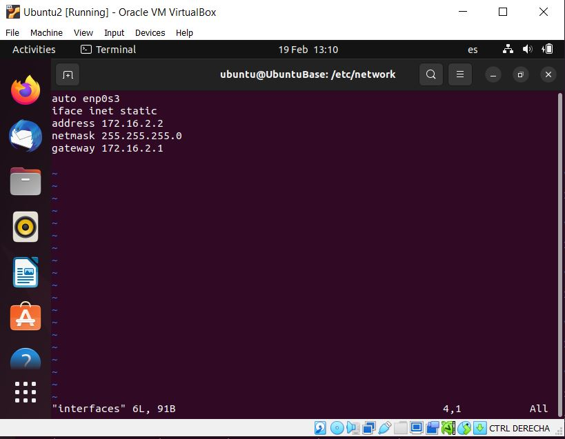
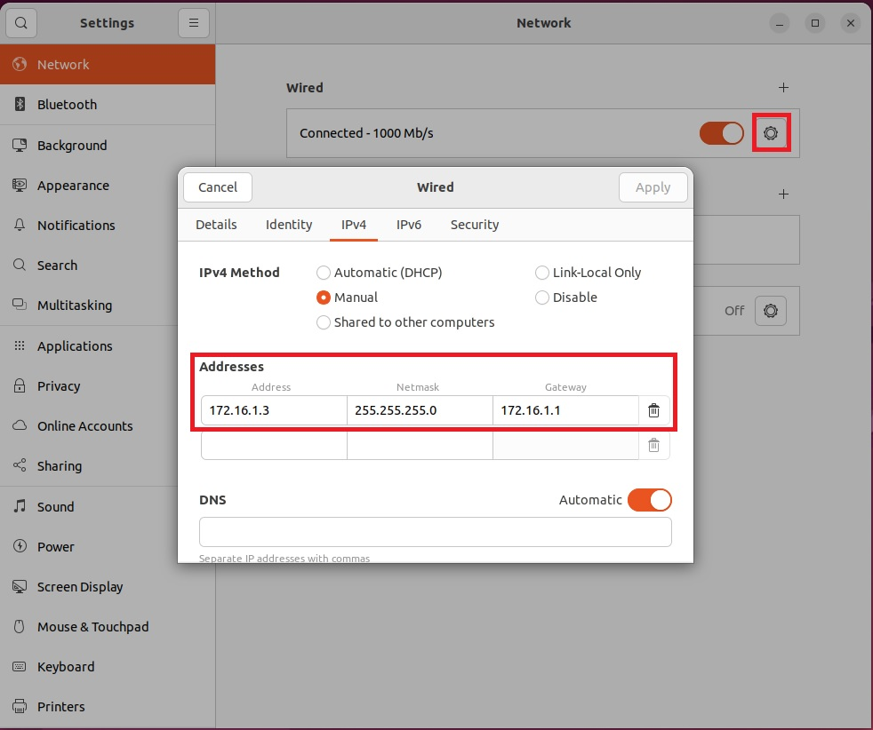
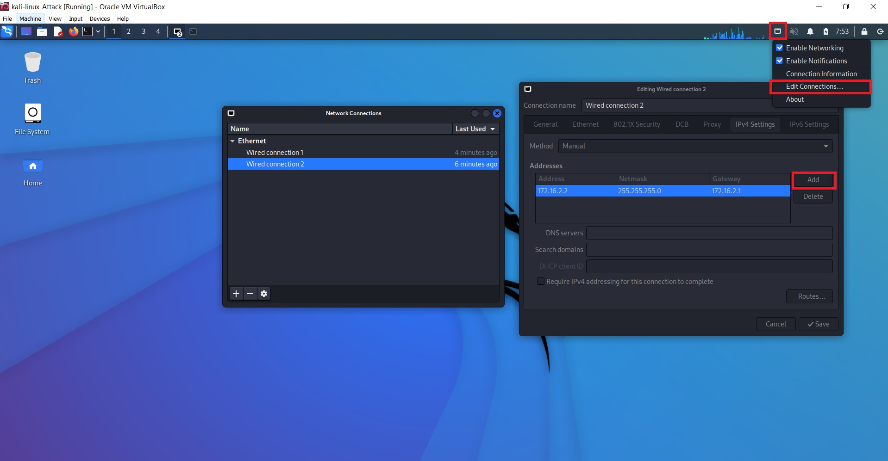

# Configuring a static IP address

## Linux

Find your network configuration

```bash
ifconfig
```

### First Option

You should see something similar to


Identify your interface, in our case would be **"enp0s3"** and create a file if it is not already created as the following one.

```bash
sudo nano /etc/network/interfaces
```

Inside, put:



Now, every time ubuntu boots up, it will catch the ip address 172.16.2.2

### Second Option



## Kali-linux

Right click in the red square of the top of the image and then as do the image.


