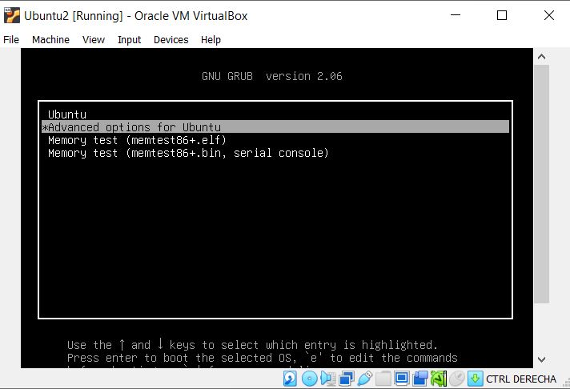

# Configuring Ubuntu 20.04 in Virtual Box 7.0

Go to the page https://ubuntu.com/download/desktop and download ubuntu 20.04 image

## Install VirtualBox guest additions

Virtual Box Version:


Install Guest adition running the following commands

```bash
cd /media/ubuntu/VBox_GAs_7.0.6
./VBoxLinuxAdditions.run
```

As the following image.


## Possible problems:

### The terminal does not open. CTRL+ALT+T does not open the terminal.

**Solution:**

Go to Settings:


Change the language to English United Kindom.


### Username is not in the sudoers file. This incident will be reported.

**Solution:**

Enter as a root and add the username to the sudoers file. For that:

Run the virtual machine and during the boot, press \<esc\>.

Select what you see in the following images:




Enter the next command:

```bash
adduser <yourUsername> sudo
```


