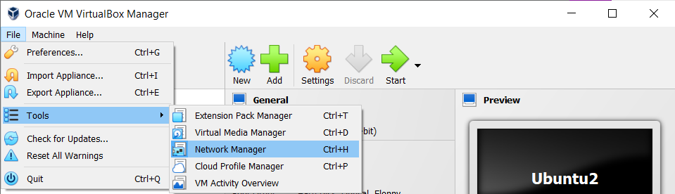

# Virtual Box

## Creating Net

**Host only networks**

The are need it to connect your virtual machine to the computer who is running the virtual machine. Uses:

- Connecting via ssh

**NAT network**

It is usefull to connect virtual machine to each other.
